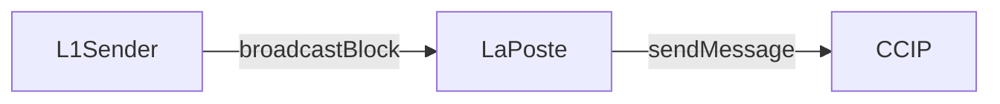
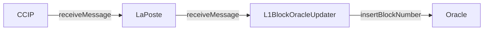

# Votemarket V2

## Overview

Votemarket V2 is an advanced evolution of the original [Votemarket](https://github.com/stake-dao/votemarket) protocol, designed to create and manage incentive campaigns for liquidity providers voting on gauge weights. The system is built on top of the [Curve Gauge Controller](https://github.com/curvefi/curve-dao-contracts/blob/master/contracts/GaugeController.vy) contract and its forks (Balancer, FXN, etc.).

[](https://github.com/stake-dao/votemarket-v2/blob/main/LICENSE)

## Key Features

- 100% permissionless
- Layer 2 deployment support
- Oracle-based data population using Storage Proofs
- Historical epoch reward claims
- Customizable campaign management through hooks
- Cross-chain compatibility
- Modular architecture for component replacement

## Improvements Over V1

| Feature | V1 | V2 |
|---------|----|----|
| Chain Support | Mainnet only | Multi-chain |
| Reward Claims | Weekly requirement | Flexible timing |
| Campaign Control | Fixed rollover | Customizable via hooks |
| Cost Efficiency | Higher gas costs | Optimized for L2 |

## System Architecture

### Component Overview

The system consists of three main components:

1. **Block Management System**
   - L1Sender: Broadcasts block information
   - LaPoste: CCIP-compatible message bus
   - L1BlockOracleUpdater: Updates Oracle with block data

2. **Campaign Management**
   - CampaignRemoteManager (L1)
   - CampaignRemoteManager (L2)
   - Votemarket Contract

3. **Oracle System**
   - Storage Proofs verification
   - Cross-chain data synchronization

### Architecture Diagrams

#### L1 Block Broadcasting


#### L2 Block Processing


### Deployment Addresses

#### Shared Infrastructure

| Contract | Address | Networks |
|----------|---------|----------|
| Bundler | [`0x67346f8b9B7dDA4639600C190DDaEcDc654359c8`](https://arbiscan.io/address/0x67346f8b9B7dDA4639600C190DDaEcDc654359c8) | Arbitrum, Optimism, Base, Polygon |
| L1Sender | [`0xD9b90F3Ab02077c21987c5fb9c4d1c5d2a10eC1C`](https://etherscan.io/address/0xD9b90F3Ab02077c21987c5fb9c4d1c5d2a10eC1C) | Mainnet |
| L1BlockOracleUpdater | [`0xaE74643A86ca9544a41c266BC5BF2d26479f64E7`](https://optimistic.etherscan.io/address/0xaE74643A86ca9544a41c266BC5BF2d26479f64E7) | Arbitrum, Optimism, Base, Polygon |
| CampaignRemoteManager | [`0x53aD4Cd1F1e52DD02aa9FC4A8250A1b74F351CA2`](https://etherscan.io/address/0x53aD4Cd1F1e52DD02aa9FC4A8250A1b74F351CA2) | Mainnet, Arbitrum, Optimism, Base, Polygon |

#### Curve Implementation
| Contract | Address | Networks |
|----------|---------|----------|
| Votemarket | [`0x5e5C922a5Eeab508486eB906ebE7bDFFB05D81e5`](https://arbiscan.io/address/0x5e5C922a5Eeab508486eB906ebE7bDFFB05D81e5) (v1)<br/>[`0x8c2c5A295450DDFf4CB360cA73FCCC12243D14D9`](https://arbiscan.io/address/0x8c2c5A295450DDFf4CB360cA73FCCC12243D14D9) (v2) | Arbitrum, Optimism, Base, Polygon |
| Oracle | [`0x36F5B50D70df3D3E1c7E1BAf06c32119408Ef7D8`](https://arbiscan.io/address/0x36F5B50D70df3D3E1c7E1BAf06c32119408Ef7D8) | Arbitrum, Optimism, Base, Polygon |
| Verifier | [`0x6095EBE7EbF2E0a912d6e293b00A6241a1A23dB3`](https://arbiscan.io/address/0x6095EBE7EbF2E0a912d6e293b00A6241a1A23dB3) | Arbitrum, Optimism, Base, Polygon |
| OracleLens | [`0x99EDB5782da5D799dd16a037FDbc00a1494b9Ead`](https://arbiscan.io/address/0x99EDB5782da5D799dd16a037FDbc00a1494b9Ead) | Arbitrum, Optimism, Base, Polygon |

#### Balancer Implementation

| Contract | Address | Networks |
|----------|---------|----------|
| Votemarket | [`0xDD2FaD5606cD8ec0c3b93Eb4F9849572b598F4c7`](https://arbiscan.io/address/0xDD2FaD5606cD8ec0c3b93Eb4F9849572b598F4c7) | Arbitrum, Optimism, Base, Polygon |
| Oracle | [`0x000000009f42db5807378c374da13c54C856c29c`](https://arbiscan.io/address/0x000000009f42db5807378c374da13c54C856c29c) | Arbitrum, Optimism, Base, Polygon |
| Verifier | [`0xBd1Af9004e5f868FB0911Fbd61650182Bef5075a`](https://arbiscan.io/address/0xBd1Af9004e5f868FB0911Fbd61650182Bef5075a) | Arbitrum, Optimism, Base, Polygon |
| OracleLens | [`0x0000000064Ef5Bf60FB64BbCe5D756268cB4e7f7`](https://arbiscan.io/address/0x0000000064Ef5Bf60FB64BbCe5D756268cB4e7f7) | Arbitrum, Optimism, Base, Polygon |

#### FXN Implementation

| Contract | Address | Networks |
|----------|---------|----------|
| Votemarket | [`0x155a7Cf21F8853c135BdeBa27FEA19674C65F2b4`](https://arbiscan.io/address/0x155a7Cf21F8853c135BdeBa27FEA19674C65F2b4) | Arbitrum, Optimism, Base, Polygon |
| Oracle | [`0x000000009271842F0D4Db92a7Ef5544D1F70bC1A`](https://arbiscan.io/address/0x000000009271842F0D4Db92a7Ef5544D1F70bC1A) | Arbitrum, Optimism, Base, Polygon |
| Verifier | [`0xd87E05De04E22b2C4EE950DF8A63622AF76af813`](https://arbiscan.io/address/0xd87E05De04E22b2C4EE950DF8A63622AF76af813) | Arbitrum, Optimism, Base, Polygon |
| OracleLens | [`0x00000000e4172A7A8Edf7C17B4C1793AF0EA76bB`](https://arbiscan.io/address/0x00000000e4172A7A8Edf7C17B4C1793AF0EA76bB) | Arbitrum, Optimism, Base, Polygon |

#### Hooks

| Contract | Address | Networks |
|----------|---------|----------|
| LeftoverDistributorHook | [`0x7a3830C1383312985cc2256F22ba6a0ce25c4304`](https://arbiscan.io/address/0x7a3830C1383312985cc2256F22ba6a0ce25c4304) | Arbitrum, Optimism, Base, Polygon |

## Getting Started

### Prerequisites

- [pnpm](https://pnpm.io/) (v8.0.0 or higher)
- [Foundry](https://book.getfoundry.sh/getting-started/installation.html)
- Python 3.7+
- [pip](https://pip.pypa.io/en/stable/installation/)

### Environment Setup

1. Clone the repository:
```bash
git clone https://github.com/stake-dao/votemarket-v2.git
cd votemarket-v2
```

2. Install dependencies:
```bash
cd packages/votemarket
pip install -r requirements.txt
make install
```

3. Set up environment variables:
```bash
cp .env.example .env
# Edit .env with your configuration
```

### Build and Test

```bash
# Compile contracts
make

# Run tests
make test

# Generate coverage report
make coverage
```

## Security

### Audits

- [Trust Security](https://docs.stakedao.org/audits)

### Known Limitations

1. Campaign Manager Control
   - Campaign Managers have significant control over campaigns
   - Potential for campaign manipulation ("rug") exists

2. Proof Verification Costs
   - Multiple proof verifications can be gas-intensive
   - Future optimizations planned through ZK Verifiers (Succinct SP1)

### Bug Bounty
Visit our [Bug Bounty Program](https://docs.stakedao.org/bug-bounty) for details on reporting security issues.

## Documentation

- [LaPoste Integration](https://github.com/stake-dao/laposte)

## Support

- [Discord Community](https://discord.com/invite/qwQfw4kmYy)
- [Forum](https://gov.stakedao.org/)

## License

This project is licensed under the [BUSL 1.1](LICENSE) - see the [LICENSE](LICENSE) file for details.

## References

- [LaPoste Repository](https://github.com/stake-dao/laposte)
- [Curve Gauge Controller](https://github.com/curvefi/curve-dao-contracts/blob/master/contracts/GaugeController.vy)

## Acknowledgments

- All contributors and auditors
